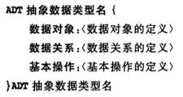
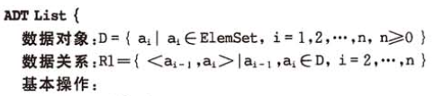
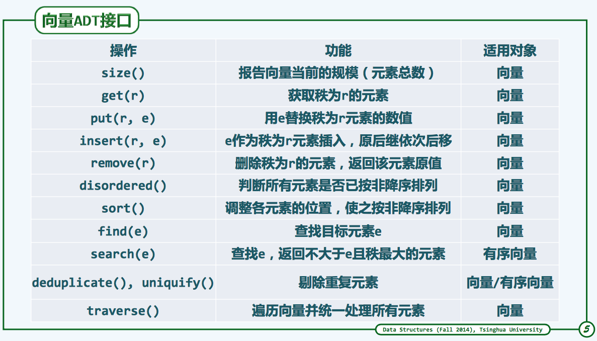

#数据结构

**自我要求**

> * 理解各基础数据结构
> 
> 
> 
> * 分别用C、C++语言实现各数据结构
> 
> * 使用各数据结构完成一定量的OJ题	
> 

**参考**

> 严蔚敏教材
> 
> [清华大学 邓俊辉 TsinghuaX: 30240184X 数据结构(2015春)]
> 
> [浙江大学 陈越、何钦铭 数据结构]
> 
> [在线演示]，[C++示例]，[清华大学OJ]，[PAT OJ]

**感受**
>
> * C没有&，表达起来真麻烦，每次都用指针，真是受够了。C++用& 代码就简洁多了。
> 

##线性表

**ADT定义:** 如上，基本操作：初始化、查找、插入、删除等

**C语言表示与实现**
>
> 线性表顺序存储实现: [SqList.c](SqList.c)
> 
> 线性表链式存储实现: [LinkList.c](LinkList.c)

##vector

**ADT定义:** 顺序存储的线性表，是数组的抽象与泛化,部分操作接口定义，如图

**C++实现:** [vector.h](vector.h)，比SqList.c使用起来更方便

[浙江大学 陈越、何钦铭 数据结构]:http://mooc.study.163.com/course/ZJU-1000033001#/info

[清华大学 邓俊辉 TsinghuaX: 30240184X 数据结构(2015春)]:http://www.xuetangx.com/courses/TsinghuaX/30240184_2015X/2015_T1/courseware/293594d41a0a459a88e4b4a5c855e723/

[清华大学OJ]:http://dsa.cs.tsinghua.edu.cn/oj/foyer.shtml

[在线演示]:http://dsa.cs.tsinghua.edu.cn/~deng/ds/demo/

[C++示例]:http://dsa.cs.tsinghua.edu.cn/~deng/ds/src_link/index.htm

[PAT OJ]:http://www.patest.cn

