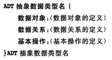

#数据结构
	
	数据结构 ＝ 数据＋结构＋操作
	
	1.数据
	
	2.结构（关系）
		存储结构
			顺序存储：数组、动态分配数组
			链式存储：链表（指针描述）、静态链表（数组描述）
		逻辑结构
			集合、线性结构、树结构、图结构
	
	3.操作
		插入、删除
		搜索
		排序
		... ...

##算法

* 排序
	
	[堆排序][heapsort.c]

* 	

##图

* 图的存储结构
	
		1. 邻接矩阵存储
			vexs[n]		// 顶点向量
	
			arcs[i][j]	// 邻接矩阵arc: vi-->vj

			type struct{ // 同arcs
				int vi,vj,w;
			}Edge[E]
			
		2. 邻接表
			typedef struct ArcNode //弧
			{
				int adjvex;
				struct ArcNode *nextarc;
			}ArcNode;
			
			typedef struct VNode //顶点
			{
				VertexType data;
				ArcNode *firstarc;
			}VNode, AdjList[N];
			
			typedef struct {		//图
				AdjList vertices;
				int vexnum,arcnum;
			}ALGraph;
			

		
* 图的遍历
	[测试数据][图1]
	[习题][图2]
	
		1.DFS
		for(图的每个顶点)
		{
			if(!visit[i])
			{
				dfs(i);
			}
		}
		
		void dfs(int i)
		{
			visit[i] = 1;
			for(i的每个邻接点)
			{
				if(!visit[j]) dfs(j)
			}
		}
		
		2.BFS
		
		void bfs()
		{
			for(图的每个顶点)
			{
				if(!visit[i])
				{
					visit[i] = 1;
					q[r++] = i;
					while(r != f)
					{
						j = q[f++];
						for(j的每个邻接点)
						{
							if(!visit[k])
							{
								visit[k] = 1;
								q[r++] = k;
							}
						}//for
					}//while
				}//if
			}
		}

* 最小生成树
[测试数据][图6]
[习题1][poj3723]

		1.Prim算法 O（N^2）
		
		假设连通网N = (V,{E})，求最小生成树TE。
		
		 #1 初始U = {v1}, TE={}
		    辅助数组D[]表示(U,V-U)
		       D[v]=0: v在U中
		       D[v]>0: v在V－U中，且U到v的最小距离为D[v]    
		 #2 找最小的(U,V-U)
		        ##1 v = min(D[]) && D[v] > 0
		    	 ##2 把v加入到U中，更新D[]
		 #3 重复#2,直到U＝V结束。此时有n-1条边。
		
		
		2.Kruskal算法 O（eloge）

		  假设连通网N = (V,{E})，求最小生成树TE。
	      #1 初始：TE={}，Ui={vi}（i=1,2,3,...）
	      #2 从E中选择一条最小的边e
	         若e的两个顶点vi,vj分别在不同的集合中则
	          ##1 merge(vi,vj) to U
	          ##2 TE = TE + {e}
	      #3 继续#2，Ui=V时结束。此时有n-1条边。

* 最短路径

[BFS求最短路径][图4]
[Djklstra求最短路径][图5]
	
		1. 无权图单源最短路径(权值相等的最短路径)
		
			BFS
			
			从S出发，BFS遍历（按路径递增遍历），找到目标则找到最短路径。
		   D[i]记录从原点S到i的距离
		   P[i]记录i的前驱（逆向输出的即为最短路径）
		   
		2. 有权图单源最短路径
		
			Dijklstra: 类似Prim算法 
				
				图存储：
				int arcs[N][N]
				S[]已经确定最短路的顶点集合S
					S[v] = 1: v在S中
					S[v] = 0：v在U－S中
				D[]最短路长
					D[v]指(s->S->v)的最短长
					D[v] = min(arcs[s][v], D[s->S->v])
				P[]路径还原
					P[v]指v的前驱
					
				Dijklstra：
				#1 从s出发到d,初始 S={s}
					D[s] = 0, D[i]=arcs[s][i],P[i] = s;

				#2 选择最小的 v = min(D[]) && !S[v] && d[v] < INF
					找到了则
						##1 S[v] = 1
						##2 v加入S后，更新D[]的最短路径，更新路径P[]
				#3 重复#2直到S＝U, D[d]为最短路长，P[d]逆向到s为最短路径
			
				
			Bellman-Ford:
			
				图存储：
				typedef struct {int vi,vj,cost}Edge;
				Edge edge[];
				
				同样用D[]存最短路长；用P[]存最短路径；
				
				#1 初始D[s] = 0, D[i] = INF
				
				#2 扫描所有的Edge e
					if(D[e.vi] != INF && D[e.vi] + e.cost < D[e.vj])
						D[e.vj] = D[e.vi] + e.cost;
						P[e.vj] = e.vi;				       		update = true;
						
				#3 重复#2直到不能update
				
		
		3.Floyd:任意两点间最短路径
			
	
* 拓扑排序（AOV网，Activity On Vertex Network）
	
		有向无环图（顶点表活动，顶点间有优先级关系）
		
		TopologicalSort
		#1 在有向图中选择一个没有前驱的顶点，访问输出该顶点
		#2 删除该顶点和以它为尾的弧
		#3 重复＃1＃2直到全部顶点都输出
		
		
* 关键路径（AOE网，Activity On Edge Network）
[习题][AOE]

		带权有向无环图（边表活动，活动有大小、有先后关系）
		
		每个活动（边、弧）：C持续时间、D机动时间
		每个节点（时间点）：编号、最早、最迟时间
		
		对于每个节点：
			最早 earliest[j] = Max ( earliest[i] + Cij )
			最迟 lastest[i] =  Min ( lastest[j]  - Cij )
		每个弧的机动时间：
			Dij = lastest[j] - earliest[i] - Cij
			
		关键路径：
			 earliest[i] = lastest[i]的时间节点为关键点
			 即，Dij=0的活动边e<i,j>为关键活动

[图1]:http://www.patest.cn/contests/mooc-ds2015spring/06-图1
[图2]:http://www.patest.cn/contests/mooc-ds2015spring/06-图2
[图4]:http://www.patest.cn/contests/mooc-ds2015spring/07-图4
[图5]:http://www.patest.cn/contests/mooc-ds2015spring/07-图5
[图6]:http://www.patest.cn/contests/mooc-ds2015spring/08-图6
[AOE]:http://www.patest.cn/contests/mooc-ds/06-图8
[poj3723]:http://poj.org/problem?id=3723

<!--图的其他练习题

[2014年春季PAT甲级考试,1小时解决]:http://www.patest.cn/contests/pat-a-practise/1076

http://www.patest.cn/contests/pat-a-practise/1003 —— 浙大计算机2008年保研上机考试真题；

http://www.patest.cn/contests/pat-a-practise/1072 —— 2013年PAT冬季考试真题；

http://www.patest.cn/contests/pat-a-practise/1087 —— 2014年PAT秋季考试真题（我们是多喜欢出最短路的题啊~），不过要做到不超时，可能还需要等何老师教你用散列表提速；

http://www.patest.cn/contests/pat-a-practise/1018 —— 浙大计算机2011年保研上机考试真题。此题有难度，跳坑须谨慎……

-->

##树结构

* 动机
		
		1.树可以表示层次关系
			表达式
			文件系统
			URL
			... ...
		
		2.树能兼顾高效的操作
			查找
			插入、删除
				
* 树存储

		1.父亲
		typedef struct PTNode
		{
			int data;
			int parent;
		}PTNode;
		
		typedef struct PTree
		{
			PTNode nodes[MAX_TREE_SIZE];
			int r;		//根的位置
			int n;		//结点数
		}PTree;
		
		适合找parent操作，eg: 并查集
		
		2.孩子
		
		
		3.父亲＋孩子
		
		4.长子＋兄弟
			树通过长子兄弟方式可转成二叉树
		
	
* 二叉树存储

		1.顺序存储
		适合：完全二叉树、满二叉树存储.一般二叉树,浪费空间。
		特点：结点i父亲为i/2,左孩子2i，右孩子2i+1
		
		2.链式存储
		typedef struct BiTNode
		{
			struct vnode* left;
			struct vnode* right;
			int data;
			//...
		}BiTNode,*BiTree;

		
* 二叉树遍历

	[习题1][树1]－[树的层次遍历][树1AC] 
	[习题2][树2]－[树的先序中序：求后序][树2AC]－[同类题][THU2-3]
	[习题3][PA2-3]－[树的先序后序：求真二叉树中序][PA2-3AC]
	
		递归遍历：先、中、后序遍历
		非递归遍历：栈，入栈顺序为先序，岀栈顺序为中序
		层次遍历：队列， LevelOrderTraversal
		
		
* 二叉搜索树（BST，Binary Search Tree）
	
	[习题1][树5]－[建完全二叉搜索树][树5AC]
	[习题2][树4]－[二叉搜索序列][树4AC]

		BST定义：
		1. 左子树 < 根结点
		2. 右子树 > 根结点
		3. 左、右子树都是BST树

* 平衡二叉搜索树（BBST，Balanced Binary Search Tree 又称AVL树）
	
	[bbst.c] － [测试样例][树3]－[Root of AVL Tree][树3AC]

		由于BST可能高度过深退化成单链，引入平衡限制：
		1. 是BST树
		2. 且左右子树高度差绝对值不超过1，|Hl- Hr| <= 1

		平衡调整策略：
		LL、LR、RR、RL
		
* 堆
	
	[heap.c]
		
	[测试样例][树6]－[小堆][树6AC]
	[测试样例][poj2431]－[大堆][2431AC]  
	[习题1][poj3253]－[小堆运用][3253AC]
	[习题2][PA4-1]－[任务调度][PA4-1AC]
		
	1. 堆的定义
		
			  大堆：k[i] >= k[2*i]  k[i] >= k[2*i+1]
			  小堆：k[i] <= k[2*i]  k[i] <= k[2*i+1]
			  i = 1,2,...,n/2
			  
			  逻辑结构：完全二叉树结构
			  存储结构：顺序存储
			  				
	2. 堆实现优先队列
			
			优先队列（Priority Queue）：
				仅对优先级最高的元素进行操作。
				C++ STL里有priority_queue。
				
			堆首元素恰好满足优先级最高的特性：	  
				pushHeap  插入到堆尾部，保持堆结构
				popHeap   删除堆首元素，保持堆结构
		
			应用：
				操作系统按优先级调度算法(大堆)
				Huffman编码算法（小堆）
			
		
* 哈夫曼树（Huffman Tree）
[习题][树8]－[Huffman Codes][树8AC]

		1.定义：
		带权路径（WPL，Weighted Path Length of Tree）最小的树，即最优二叉树。
				
		2.哈夫曼树构建方法：
		找权值最小的两个子二叉树合并, 如何找最小的两个呢？小堆！
		
		3.哈夫曼编码，不等长编码二义性避免
		前缀码，任何字符的编码都不是另一字符编码的前缀。
		
* 并查集
[习题][树7]－[并查集练习][树7AC]

		1.存储：
		集合，森林结构，树根Root带表一个集合。双亲表示法，数组存储。
		
		typedef struct MFSet
		{
		//> 0代表父结点；	= 0代表空集；	< 0代表根结点(负数表示该集合的元素个数)
			int parent;
			int data;
		} MFSet[N];
		
		＃并
		只需把一个集合的parent设为另一集合的Root即可
		
		# 查: 查找某个元素所在的集合（根结点Root）		

##线性结构

* 向量

* 列表

* 栈

* 队列 

* 串

**自我要求**

> * 理解各基础数据结构
> 
> 
> 
> * 分别用C、C++语言实现各数据结构
> 
>   实现的算法、代码中犯过的错
> 
> * 使用各数据结构完成一定量的OJ题	
> 

**参考**

> 严蔚敏教材
> 
> [清华大学 邓俊辉 TsinghuaX: 30240184X 数据结构(2015春)]
> 
> [浙江大学 陈越、何钦铭 数据结构] － [PAT作业]
> 
> [在线演示]，[C++示例]，[清华大学OJ]，[PAT OJ]

**感受**
>
> * C没有&，表达起来真麻烦，每次都用指针有些麻烦，C++用&（引用）代码就简洁多了。
> 
> * 我习惯的C命名规范:
> 	
> 		1.结构体使用帕斯卡命名法
> 		2.而函数、变量使用骆驼命名法
> 
> * 一般解题过程
> 	
>		元素类型
>		逻辑结构-->存储结构
>		运算操作
>
> 
>  		#### 清华大学校长留给毕业生的五句话

##OJ

静态链表：
[Reversing Linked List](MOOC-DataStruct2015spring/02-线性结构2.ReversingLinkedList.c)

双链表：
[祖玛(Zuma)](TsinghuaX－30240184X/MOOC-PA1/Zuma.c)

排序＋二分查找：
[范围查询(Range)](TsinghuaX－30240184X/MOOC-PA1/range_A.c)

排序＋求逆序数
[灯塔(LightHouse)](TsinghuaX－30240184X/MOOC-PA1/LightHouse.c)

栈的次序
[列车调度(Train)](TsinghuaX－30240184X/MOOC-PA2/Train.c)
[Pop Sequence](MOOC-DataStruct2015spring/02-线性结构3.PopSequence.c.c)

[树1]:http://www.patest.cn/contests/mooc-ds2015spring/03-树1
[树1AC]:MOOC-DataStruct2015spring/03-树1.ListLeaves(25).c

[树2]:http://www.patest.cn/contests/mooc-ds2015spring/03-树2
[树2AC]:MOOC-DataStruct2015spring/03-树2.TreeTraversalsAgain(25).c

[树3]:http://www.patest.cn/contests/mooc-ds2015spring/04-树3
[树3AC]:MOOC-DataStruct2015spring/04-树3.RootofAVLTree(25).c

[树4]:http://www.patest.cn/contests/mooc-ds2015spring/04-树4
[树4AC]:MOOC-DataStruct2015spring/04-树4.SearchinaBinarySearchTree(25).c

[树5]:http://www.patest.cn/contests/mooc-ds2015spring/04-树5
[树5AC]:MOOC-DataStruct2015spring/04-树5.CompleteBinarySearchTree(30).c

[树6]:http://www.patest.cn/contests/mooc-ds2015spring/05-树6 
[树6AC]:MOOC-DataStruct2015spring/05-树6.Path-in-a-Heap(25).c

[树7]:http://www.patest.cn/contests/mooc-ds2015spring/05-树7
[树7AC]:MOOC-DataStruct2015spring/05-树7.FileTransfer(25).c

[树8]:http://www.patest.cn/contests/mooc-ds2015spring/05-树8
[树8AC]:MOOC-DataStruct2015spring/05-树8.HuffmanCodes(30).c

[PA2-3]:http://dsa.cs.tsinghua.edu.cn/oj/problem.shtml?id=405
[PA2-3AC]:TsinghuaX－30240184X/MOOC-PA2/ProperRebuild.c
[THU2-3]:http://dsa.cs.tsinghua.edu.cn/oj/problem.shtml?id=388	

[poj2431]:http://poj.org/problem?id=2431
[2431AC]:../OnlineJudge/POJ/poj2431Expedition.c

[poj3253]:http://poj.org/problem?id=3253
[3253AC]:../OnlineJudge/POJ/poj3253FenceRepair.c

[PA4-1]:http://dsa.cs.tsinghua.edu.cn/oj/problem.shtml?id=409
[PA4-1AC]:TsinghuaX－30240184X/MOOC-PA4/任务调度(Schedule).c

[heap.c]:MOOC-DataStruct2015spring/heap.c
[bbst.c]:MOOC-DataStruct2015spring/bbst.c
[heapsort.c]:MOOC-DataStruct2015spring/heapsort.c

[浙江大学 陈越、何钦铭 数据结构]:http://mooc.study.163.com/course/ZJU-1000033001#/info

[PAT作业]:http://mooc.study.163.com/learn/ZJU-1000033001#/learn/custom?id=1000052001

[清华大学 邓俊辉 TsinghuaX: 30240184X 数据结构(2015春)]:http://www.xuetangx.com/courses/TsinghuaX/30240184_2015X/2015_T1/courseware/293594d41a0a459a88e4b4a5c855e723/

[清华大学OJ]:http://dsa.cs.tsinghua.edu.cn/oj/foyer.shtml

[在线演示]:http://dsa.cs.tsinghua.edu.cn/~deng/ds/demo/

[C++示例]:http://dsa.cs.tsinghua.edu.cn/~deng/ds/src_link/index.htm

[PAT OJ]:http://www.patest.cn

